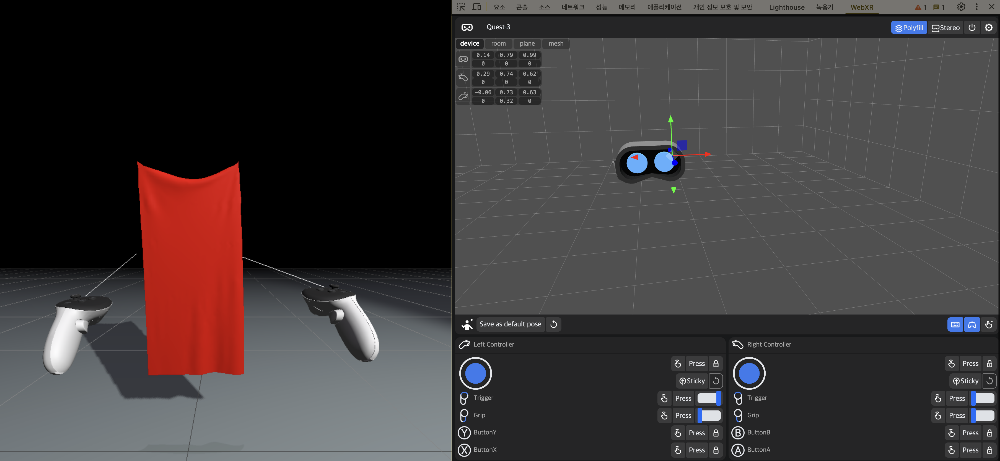
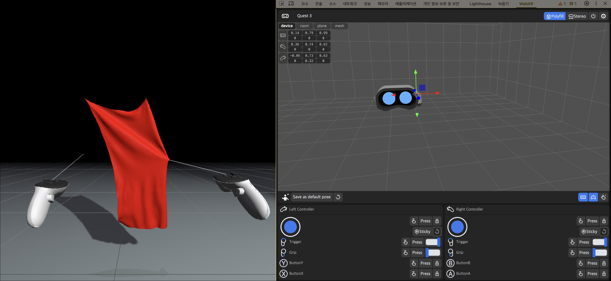

# Cloth VR Project

A real-time cloth simulation extended to VR using Three.js and WebXR.  
This project allows users to interact with a dynamic cloth using VR controllers in a browser environment.

This project is an extended version of the cloth simulation demo from Matthias Müller's Ten Minute Physics series.
Original project by Matthias Müller.
➡️ [Original Demo on GitHub](https://github.com/matthias-research/pages/blob/master/tenMinutePhysics/14-cloth.html)

## Features

- 👚 Real-time cloth physics simulation (PBD & XPBD)
- 🎮 VR Controller interaction (grab & move & change light colors)
- 🌐 Web-based and responsive
- 🛠️ Built with Three.js and WebXR

## Recommended Environment

This project works best in **Google Chrome** with **WebXR-enabled VR devices** (such as Meta Quest).  
To use VR mode, your browser must support **WebXR**. On some devices, you may need to enable experimental WebXR flags or install the **WebXR API Emulator** extension for testing in desktop browsers.

## Preview

