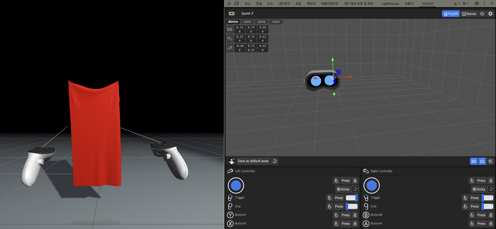
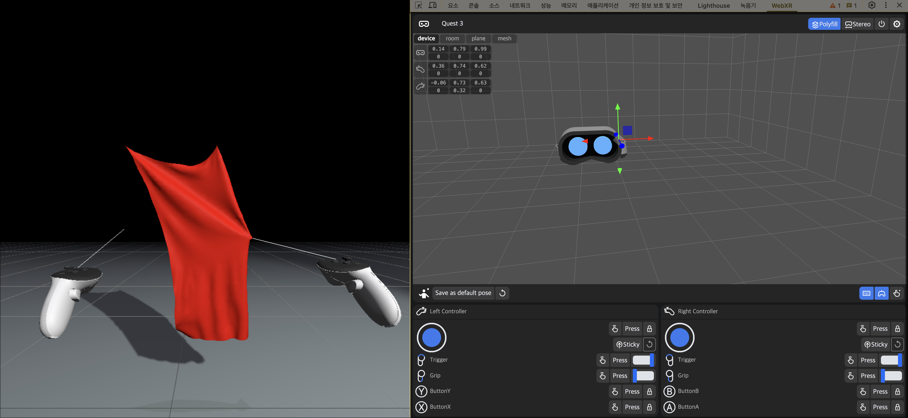

# Web-Based Cloth Simulation (VR Project)

 

- 🏅 **Best Paper Award**, Korea Society of Computer and Information (KSCI) Conference 2024    
  ⤷ *"Web-based virtual reality framework for physically-based cloth simulation and interaction"*  
  ⤷ 「웹 기반 물리 기반 천 시뮬레이션 및 상호작용을 위한 가상현실 프레임워크」 논문 발표  
  ⤷ [📎 논문 보기](https://www.dbpia.co.kr/journal/articleDetail?nodeId=NODE11926276)  

A real-time cloth simulation extended to VR using Three.js and WebXR.  
This project allows users to interact with a dynamic cloth using VR controllers in a browser environment.

This project is an extended version of the cloth simulation demo from Matthias Müller's Ten Minute Physics series.
Original project by Matthias Müller.
➡️ [Original Demo on GitHub](https://github.com/matthias-research/pages/blob/master/tenMinutePhysics/14-cloth.html)

## Features

- 👚 Real-time cloth physics simulation (PBD & XPBD)  
  ( PBD와 XPBD 기반의 실시간 옷감 물리 시뮬레이션입니다. )
  
- 🎮 VR Controller interaction (grab & move & change light colors)  
  ( VR 컨트롤러로 옷감의 한 부분을 잡고 움직일 수 있으며, 조명의 색상까지 변경 가능합니다. )

- 🌐 Web-based and responsive  
  ( 웹 브라우저에서 실시간으로 작동합니다. )
  
- 🛠️ Built with Three.js and WebXR  
  ( Three.js와 WebXR 기술로 제작되었습니다. )

## Recommended Environment

This project works best in **Google Chrome** with **WebXR-enabled VR devices** (such as Meta Quest).  
To use VR mode, your browser must support **WebXR**. On some devices, you may need to enable experimental WebXR flags or install the **WebXR API Emulator** extension for testing in desktop browsers.

## Preview (WebXR Emulator)

## Demo video (VR mirroring screen)
<video src="https://github.com/user-attachments/assets/1088a2ba-d7f7-4201-a2ac-aa7ca0a740e5" controls></video>
